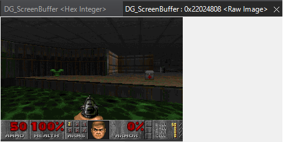
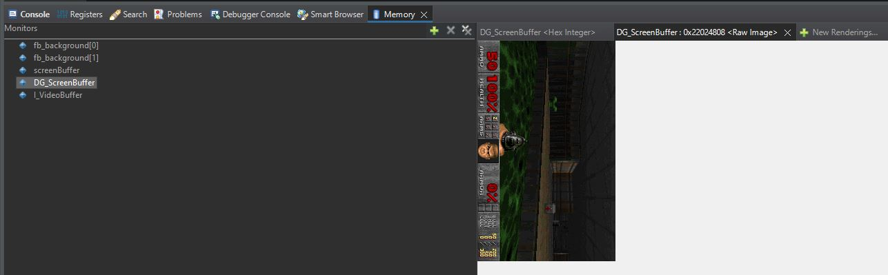

# Verifying operation
1. Grab an EK-RA8D1. 
2. If you've been using the kit before, locate and change all jumper settings back to the default per the Kit User's manual.
3. Turn off power, and then toggle all switches of SW1 to OFF. Set SW1-3 and SW1-8 to ON. Plug in the LCD.
4. Open Renesas Flash Programmer > Initialize Device > Set DLM State to OEM_PL2 > Program an SREC file along with TrustZone boundary settings (.rpd file)
5. Enjoy! Use Teraterm to connect to the JLink CDC UART port to view some logs.

# Challenges / TODO
Below are some of the left over challenges to which you can contribute. Send me a Pull Request, with a write-up/explanation of what's changed, and I'll merge it in for the greater good. Ultimate goal is to stay above 60+ fps.
- [ ] **!BUG**: Fix the hang issue
      This *may* be a problem with long term operation of the USB stack. The EK-RA8D1 & EK-RA8M1 quickstart examples seem to behave the same; i.e. dead USB communication after operating for a long time. Kit information doesn't update.
- [ ] **!BUG:** DMAC and DTC do not work with the USB and UART stacks.
- [ ] **!BUG**: if doomgeneric folder is moved out of src folder, the graphics display operation goes bad. Also hang issue occurs sooner.
- [ ] **Enable feature:** Get the `-timedemo` working to get the framerate calculated from doom.
- [ ] **Improve Performance**: Move USB MSC Flash Drive to High-speed IP
- [ ] **Improve Performance**: Move away from storage on external USB MSC Flash Drive to OSPI on-board EK-RA8D1- to store the WAD and for saving data.
- [ ] **Enable Feature**: Implement Keyboard integration to actually play the game.
- [ ] **Enable Feature**: Enable sound
- [ ] **Enable Feature**: Allow loading of other game wad files without needing to re-compile.
- [ ] **Enable Feature**: Net play over IP and a WiFi module. Demo a deathmatch.
- [ ] **Hardware Acceleration**: Remove use of `cmap_to_fb` in `I_FinishUpdate` and use DAVE2D's Color Look Up Tables (CLUT)
- [ ] **Hardware Acceleration**:Transition entire project from GCC to LLVM and enable Helium instruction-set for more performance
- [ ] **Hardware Acceleration**: Integrate DRW to draw primitives instead of using the CPU
- [ ] **Hardware Design**: Design game-boy console like board. 
	- [ ] Overcome 16-bit SDRAM limitation on EK-RA8D1. The 16-bit bus means 1/2 the max achievable data-rate
	- [ ] Add in a Renesas/Dialog WiFi module over a high-throughput interface
	- [ ] Add hardware for sound (input & output) using a Renesas/Dialog Codec IC.

# Notes
Upon it's release in December 10, 1993, DOOM was known for its advanced graphics and 3D environments, and it quickly became a benchmark for testing the performance of new computer hardware. As technology progressed, the question "Can it run DOOM?" became a humorous way to ask whether a device or system, regardless of its intended purpose, was powerful enough to handle the game.

Over the years, the phrase has evolved into a meme and is often used in a lighthearted manner to inquire about the capabilities of various devices, ranging from smartphones to kitchen appliances. It reflects the historical significance of DOOM as a demanding and iconic piece of software that has been adapted to run on a wide variety of platforms.

Staying true to this tradition, and in the essence of learning the capabilities of the RA8D1 MCU, I decided to benchmark the performance of DOOM by porting it to the EK-RA8D1. This repository contains my first attempt in porting DOOM to a new platform.

Below is an outline of my goals during porting. Subsequent sections go into further details for each goal, explaining the rationale, steps, challenges encountered, solutions created, learnings, and other wanderings for the future. 
1. Select a version of DOOM to port
2. Build an elf
3. Render the frames in memory
4. Render the frames on the screen
5. Maximize the screen
6. Improve the performance
7. Commit my changes, if any, back to the selected version of DOOM
8. Call it a day and let others contribute :)

## Select a version of DOOM to port
DOOM has been ported by multiple entities and multiple repositories exist. The one that got me interested was the [doomgeneric](https://github.com/ozkl/doomgeneric) repo which appeared in an article on [Adafruit](https://blog.adafruit.com/2023/01/24/porting-doom-just-got-easier-with-doomgeneric-gaming-software/). As noted, doomgeneric is a project to make porting Doom easier. Of course Doom is already portable, but with doomgeneric it is possible with just a few functions. The work is under a GNU General Public License v2.0.

This was enough motivation to get started. Seems simple and lightweight; but what do I sacrifice for portablility? Only time, and benchmarking performance would tell the true story.

## Build an elf
The first step in building get an existing application functional is to get it to build an image. From looking at the repo, it seemed fairly straight forward that including the source files in an e2studio project would be sufficient. That's exactly what I did to find where the build would fail.

From understanding the needs of gaming, it made sense to throw an RTOS to allow for modularity, and managing timing. ThreadX was the choice since it also comes with a bunch of other modules like FileX which would be helpful for reading the WAD files.

Unfortunately, the FSP with RA8D1 doesn't allow for creating a USB Mass Storage Controller drive on the plenty big OSPI. So, I worked around it using FileX over USBX MSC Host. It's a hefty price to pay; but hey, it's a PoC. Other components I'd need would be to operate the GLCDC with MIPI DSI screen. Fortunately, there's are ready made [examples](https://github.com/renesas/ra-fsp-examples/tree/master/example_projects/ek_ra8d1) showing off most components, H/W & S/W, for the RA8D1.

Initial PoC operation should be simple:
1. User puts a WAD onto a USB drive from a PC
2. User inserts USB drive into the EK-RA8D1 USB port
3. The game runs based on parameters passed in. 
4. No need for keyboard input for a POC. 

After throwing in ThreadX and the doomgeneric sources, a happy surprise, only a few calls were identified as missing by the compiler. These were
1. `mkdir`
2. `exit`
3. `_lseek`
4. `_open_`
5. `_close_`
6. `_read`
7. `_write`
8. `_fstat`
9. `_link`
10. `_unlink`
11. `_isatty`
12. `_lseek`

So I implemented them to read from the USB drive. Any file handle < 3 would point to stdout, stdin, and stderr. So those I output them to a serial port which connects to the JLink CDC UART pins. Other file handles are  processed by FileX in the implementation. 

Of course, I added in the remaining empty DG_xFunctions as recommended in the README. Didn't really care about DG_Init and DG_DrawFrame for now; but other required ones were implemented to provide the needed functionality.

With that, we have 0 errors! (And many warnings ...)

## Render the frames in memory

This was the most exciting part. From reading the description, when Program Counter hits `DG_DrawFrame` "Frame is ready in `DG_ScreenBuffer`. Copy it to your platform's screen." So the new goal was to overcome all obstacles to reach `DG_DrawFrame`. In doing so, I got deeper into doomgeneric's implementation. Looked like a lot of memory is malloc'ed. FSP puts the heap into the RA8D1's SRAM. Changing this was as simple as 1 line change in the fsp.ld from SRAM to SDRAM file. Allocated about 32MB, (because why not...). Next, I put a breakpoint in `DG_DrawFrame`, and then viewed the `DG_ScreenBuffer` variable as a Raw Image in e2studio. Another milestone; I see a 320 x 200 image in memory. 

But e2studio doesn't render the image as fast since the PC reading RA8D1 memory through a JTAG. Next step is to put the image on the actual LCD screen.

## Render the frames on the screen

Solving this challenge was easy; import in some code from the MIPI DSI example project which renders some color bands to the screen before DG_Init; then when `DG_DrawFrame` hits, copy `DG_ScreenBuffer` into the GLCDC's framebuffer. I used the double bufferring mechanism to avoid tearing. `R_GLCDC_BufferChange` was a helpful API here.

I also brought down DG_ScreenBuffer resolution to the original buffer size of 320x240 to make the image fit on the screen. From peeking inside `I_FinishUpdate`, I see there's a copy routine which scales the image to a multiple of the `SCREENWIDTH` and `SCREENHEIGHT` preprocessor. So, scaling down also prevents a bunch of CPU operations. The RA8D1 has a DRW engine with the ability to do BLIT operations. Maybe that can be used to scale in parallel instead of putting the CPU to monkey-work.

## Maximize screen
The problem with EK-RA8D1 is that the screen is portrait mode where as DG_ScreenBuffer is rendered in landscape. This would be a problem which needed solving next. Again, going into `I_FinishUpdate` I decided it's better to rotate the image directly during the copy to DG_ScreenBuffer. From looking into the routine, it's written to increment line-by-line on screen where `cmap_to_fb` converts the information in `I_VideoBuffer` from a Color Look Up Table to the corresponding ARGB values. At it's core, the function is rendering a single line. It's a great location to rotate. I created a single row of pixels to pass into `cmap_to_fb` and then scatter the pixels into the proper location within the `DG_ScreenBuffer`. 

After fixing some of the math, we have a rotated image! and This also improves some performance by avoiding the need to create another rotated buffer.

But there's a still a lot of black pixels visible on the screen. Fixing that would need the DRW engine to scale the image. Fortunately, there's documentation, and an example on DRW. At the time of writing, the DRW example existed for [RA6M3 MCU](https://github.com/renesas/ra-fsp-examples/tree/master/example_projects/ek_ra6m3g/drw/drw_ek_ra6m3g_ep); so I brought `d2_blitcopy` and other needed [DAVE/2D APIs](https://www.renesas.com/us/en/document/lbr/tes-dave2d-driver-documentation) in. And I had a scaled image. Beautiful!

I had to wrap my head around how DRW would have to work with the double buffer. When you call the `d2_flushframe` API, DAVE/2D runs DRW to render the previous frame. So, the trick is to not render the buffer which was just passed into the `d2_*` API. Otherwise, I noticed jitter on screen.

## Improve performance
Rotating the buffer during `cmap_to_fb`, and switching over to using DRW were some good performance improvements. Next I decided to play with a few standard knobs I knew:
1. GCC Optimization setting: This is an easy change. Go from `-O0` to `-Ofast`. Not bad going from 3-4 fps to around 18 fps.
2. Enable the data-cache: The RA8D1 MCU has a data-cache built around the Cortex-M85 CPU. If you look carefully at the architecture, and the EK-RA8D1's design you find the SDRAM, where most of the heap and framebuffer is located, is running at 120MHz and a 16-bit bus. It does handicap the performance, when the CPU is running at 4x the speed. So turning-on the cache seemed like a no-brainer. Fortunately, doom is written VERY well. I think they encountered the use of caches during development. With one small change in the BSP inside the FSP configurator, cache was working. A whooping increase to > 50 fps!!! Observed performance is buttery smooth. Also, there were some tearing effects happening with the cache turned off; which magically disappeared. Which, I need to understand why in the future....
3. (Didn't do ...) Arm Helium Instruction set: The EK-RA8D1 MCU touts an instruction set for ML. This, in my layman's understanding, should make it good at DSP. The problem is that, as of writing this material, GCC/IAR/Keil doesn't support auto-vectorization. I.e. all those for loops which could benefit from Helium instructions are still compiled using non-SIMD instruction set. The only compiler touted to support auto-vectorization is [LLVM](https://github.com/ARM-software/LLVM-embedded-toolchain-for-Arm/). I'll leave this as a challenge for the next person. In my books, above 30 fps is visually acceptable; 50+ fps is nice; 60+ fps is [rip & tear](https://www.youtube.com/watch?v=U-3kJcBfQ9w). My calculations indicate current performance w/o Helium is in-between.
4. (Didn't do ...) Maximize use of DMAC with USB stack. Use the DTC with the UART Communications stack. Unfortunately, both failed to work with `-Ofast` optimazation. Will leave this as challenge for others to find the bug. My speculation is that the data cache has a role to play here which is not being addressed by the driver.

## Commit my changes to the original doomgeneric repo.
As a good citizen, I'm putting up my changes which don't break the functionality to the original doom repo. 
The pull request is: https://github.com/ozkl/doomgeneric/pull/12

And if you want to learn more about the journey, you can dig into the sources of this repo.

##  Call it a day and let others contribute :)
If you've read this write up so far, you've reached the end of me putting thoughts on the internet. Now, Can it run DOOM? 